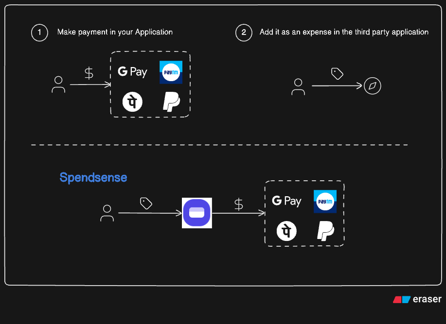
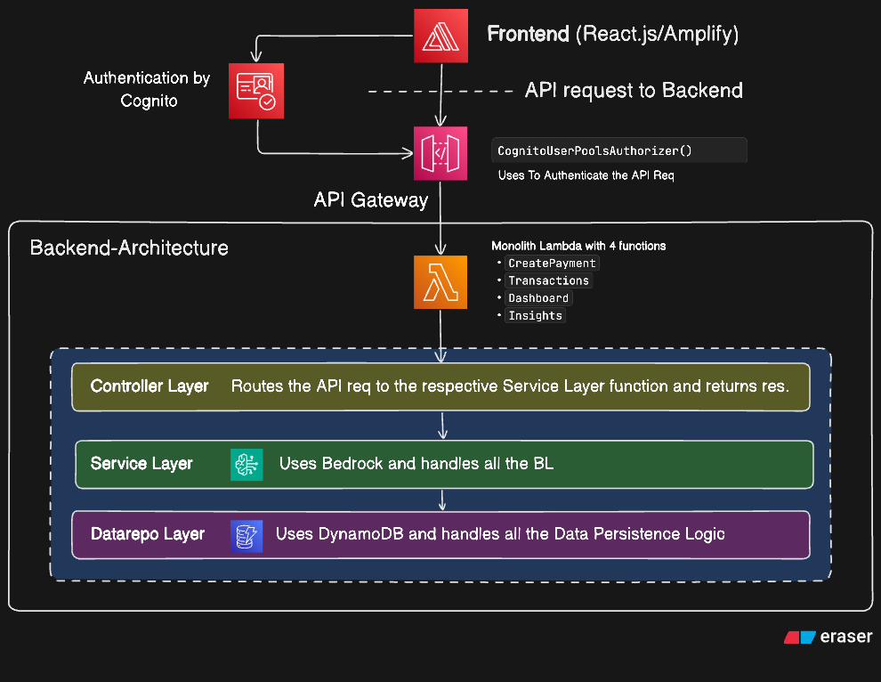

<div align="center">

# SpendSense

[](https://react.dev/) [](https://www.typescriptlang.org/) [](https://aws.amazon.com/cdk/) [](https://aws.amazon.com/lambda/) [](https://aws.amazon.com/api-gateway/) [](https://aws.amazon.com/dynamodb/) [](https://aws.amazon.com/cognito/) [](https://aws.amazon.com/bedrock/) [](https://aws.amazon.com/amplify/) [](https://aws.amazon.com/cloudwatch/) [](https://www.npci.org.in/what-we-do/upi/product-overview)

</div>

### Intelligent Personal Finance & Payment Companion

SpendSense helps users **track, understand, and act on their finances** by combining transaction analytics, recurring expense detection, UPI payments, and Generative AI.

> **Track your spending. Understand your habits.**

---

**[Visit Spendsense](https://main.d1c0v37p7fuxw4.amplifyapp.com/)**

## Overview

Traditional expense trackers tell you **where your money went**.

SpendSense goes a step further by helping answer:

- Where am I spending the most?
- What expenses are recurring?
- How is my spending changing?
- What financial patterns should I know about?
- Can I initiate a payment from the same platform?

### The core product problem

Most money apps stop at tracking. They show transactions, totals, and categories, but they rarely help users understand the underlying story behind the numbers.

SpendSense solves that by reducing the friction between awareness and action:

- users can monitor spending patterns in one place
- they can identify high-risk or non-essential spending
- they can uncover recurring subscriptions and silent drains
- they can make or review payment actions without leaving the app

This creates a single flow from financial understanding to financial action.



---

## Why this project matters

People do not need another app that only logs expenses. They need a tool that helps them:

- spot behavioural patterns in spending
- understand recurring obligations
- plan within a monthly budget
- reduce unnecessary charges and duplicate payments
- act on money decisions without jumping across apps

SpendSense is designed around that idea: one experience that supports tracking, insight generation, and transaction execution.

---

## Architecture

The project combines a modern frontend with a serverless backend and cloud-native infrastructure.

### Frontend

- React + TypeScript
- Vite for development and build tooling
- Tailwind CSS for styling
- Framer Motion for motion and polish
- AWS Amplify integration for authentication and app-level services

### Backend

- TypeScript-based Lambda handlers
- REST-style API exposed via API Gateway
- DynamoDB for persistence
- Layered architecture for controllers, services, repositories, and domain logic

### AI and cloud services

- Amazon Bedrock for AI-driven insight generation
- Amazon Cognito for authentication and user management
- AWS CDK for infrastructure provisioning
- DynamoDB and Lambda as the application backbone

### System overview



---

## Features

| Feature                   | Description                                                                      |
| ------------------------- | -------------------------------------------------------------------------------- |
| **Financial Dashboard**   | Spending overview, category breakdowns, trend analytics, and recent transactions |
| **Transaction Tracking**  | Track expenses by merchant, category, method, and status                         |
| **Recurring Payments**    | Detect subscriptions and recurring spend patterns                                |
| **AI Insights**           | Generate personalized recommendations using Amazon Bedrock                       |
| **UPI Payment Flow**      | Initiate payment intent-style flows inside the same ecosystem                    |
| **Secure Authentication** | JWT-based authentication and user identity through Cognito                       |
| **Premium Product UX**    | Responsive landing page and dashboard experience designed for clarity and trust  |

---

## Product Flow

A typical SpendSense user journey looks like this:

1. Sign up or log in securely
2. Review recent transactions and category summaries
3. See recurring or abnormal spending patterns
4. Get AI-generated explanations and suggestions
5. Evaluate payment actions or next-step recommendations
6. Continue a loop of monitoring, understanding, and improving financial decisions

This makes SpendSense more than a tracker. It acts as a lightweight decision-support system for personal finance.

---

## Repository Structure

```text
.
├── README.md
├── API_SPEC.md
├── amplify.yml
├── backend/
│   ├── bin/
│   ├── infrastructure/
│   ├── contorller/
│   ├── service/
│   ├── repositories/
│   ├── src/
│   ├── cdk.json
│   ├── package.json
│   └── tsconfig.json
├── frontend/
│   ├── public/
│   ├── src/
│   ├── package.json
│   ├── vite.config.ts
│   ├── tailwind.config.js
│   └── index.html
├── Spendsense.png
├── Spendsense-backend.png
└── package.json
```

---

## API and Data Model

The backend API is documented in [API_SPEC.md](API_SPEC.md). It defines:

- authentication rules and JWT expectations
- dashboard response structure
- transaction and payment endpoints
- recurring-payment detection payloads
- common success and error response formats

This ensures the frontend and backend cooperate around a consistent contract.

---

## Project status

This repository represents an MVP-style fintech product prototype with working end-to-end patterns for:

- dashboard analytics
- transaction understanding
- recurring spend detection
- AI-assisted financial insights
- secure backend access
- payment-oriented product flows

It is structured to grow into a more comprehensive personal finance platform with deeper automation, personalization, and production-grade operations.

---

## License

This project is currently intended for personal and prototype use unless a separate license is added.
